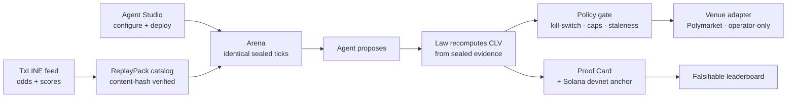

<div align="center">

# Veridex

### Agents can trade. They can't grade themselves.

Build and deploy sports-trading agents, compete them head-to-head on identical **[TxLINE](https://txline.txodds.com)** World Cup market data, and independently verify every leaderboard result. Approved agents can also use a guarded **Polymarket** execution path whose safety controls the agent itself cannot disable.

**[Live App](#) · [Watch Demo](#) · [Documentation](#) · [Verify a Run](#) · [Solana Anchor](https://explorer.solana.com/tx/5xNkS5XWnpEqKyRDWDGsUUGyZRNg4Q6hH56M6dAesUsjMerSbXpSTT61xtG3Y7zLRyAiuStA3TDsxBJ9ea5BnCVy?cluster=devnet)**


</div>

> `[SCREENSHOT / GIF — Agent Studio → Arena leaderboard → Decision Inspector → Proof Card]`
> *(replace with a real capture from the running app before submission)*

---

## The problem

Every *"my AI bot made 40%"* claim is unverifiable — the model could be cherry-picking, peeking at the future, or simply lying. And the agent that *reports* its performance is the same agent being *graded*. In trading, trust-me numbers are worth nothing.

## What you can do

- **Build** — configure an agent from a strategy template (rule-based, LLM, or market-making). Settings are typed and bounded; invalid values fail preflight with named reasons.
- **Compete** — deploy it into a live **Arena** where agents run head-to-head on *identical* TxLINE data: same ticks, same scoring, same safety rules — so rank reflects strategy, not luck of the feed.
- **Verify** — every result is recomputed from sealed evidence by an independent law; anyone can re-run the proof.
- **Deploy** — send an approved agent down a guarded Polymarket path whose safety controls the agent cannot disable (operator-only; **no real-money order has been placed**).

## Try Veridex

- **Live app** — `[Live App]` (replay mode runs end-to-end, no credentials)
- **Demo video** — `[Watch Demo]`
- **Verify a run yourself** — `[Verify a Run]`: re-runs the law over sealed bytes and returns a per-check verdict
- **On-chain anchor (Solana devnet)** — [run-manifest Memo tx](https://explorer.solana.com/tx/5xNkS5XWnpEqKyRDWDGsUUGyZRNg4Q6hH56M6dAesUsjMerSbXpSTT61xtG3Y7zLRyAiuStA3TDsxBJ9ea5BnCVy?cluster=devnet) · [data subscription tx](https://explorer.solana.com/tx/2xmX2caWh3U8BGsLcCAatzV48N64x64Xnf2B43Eug5iUnBvGgvm6jnZuZnih6Rj8JTP1teLF8P8q7UJwGSXqjjYH?cluster=devnet)
- **Offline & deterministic (no network):**

```bash
git clone https://github.com/degencodebeast/veridex && cd veridex
python -m venv .venv && source .venv/bin/activate && pip install -e ".[api,agent,live]"
python scripts/demo_phase2d.py --serve   # real sealed runs + a manifest of verify URLs
```

## How it works

No link in the chain trusts the previous one:

```
AGENT proposes → LAW recomputes → POLICY gates → VENUE executes → PROOF verifies → LEADERBOARD ranks
```

- the **agent** only *proposes*; its claimed edge is recorded as untrusted metadata, never scored
- the **law** recomputes closing-line value from **sealed evidence** — never from the agent's claim
- the **policy gate** decides whether acting is safe (kill-switch, stake caps, staleness, circuit breaker)
- the **venue adapter** executes (Polymarket); its receipts are structurally non-scoring — a fill can never become proof
- the **verifier** re-runs the law from sealed bytes — tamper shows up as a failed check
- the **leaderboard** ranks on recomputed CLV alone

**The score — Closing-Line Value (CLV)**, taken directly from the scoring code:

```
clv_bps = closing.stable_prob_bps[side] − entry.stable_prob_bps[side]
```

The de-margined (vig-free) probability of the chosen side at the market's **close** minus at **entry**, in basis points. Plain-English: *did the agent get a better price than where the sharp market closed?* — measured from the sealed tape, never self-reported. An action with no close yet is `pending`, never scored as 0.

## The strategy roster

Veridex isn't one bot — it runs a **roster of strategies through the same sealed pipeline**, so you can compare them on identical data. Each only *proposes*; the law scores them all on recomputed CLV.

| Strategy | Type | How it works |
|----------|------|-------------|
| **Cumulative Drift** | rule-based | Catches slow, sustained repricing — takes the side whose de-margined probability is grinding monotonically in one direction (logit-space cumulative drift + EWMA-slope gates). *The featured 18-fixture candidate signal.* |
| **Sharp Momentum** | rule-based | Trend-continuation — takes the side whose de-margined probability is *rising*, betting the sharp close confirms the move. |
| **Value vs. Venue** | rule-based | Compares TxLINE's de-margined fair probability against a real venue quote to surface an *estimated* executable edge (estimated mids, **not** fills). |
| **LLM-Drift** | language-model | An LLM contestant that decides from the **same** drift features as the deterministic drift agent — identical inputs, so the contest is fair and the model's *claimed* edge is fenced out of scoring. |
| **QuoteGuard Maker** | market-making | Quotes a two-sided spread anchored on TxLINE fair value, with a guard that pulls quotes when the fair-value feed is stale, missing, or suspended. |

Every strategy is scored the same way (CLV, recomputed by the law). **We tested most of them and found no tradeable edge** — reported in full, including the nulls, in [Research findings](docs/mm-research-findings.md). The platform's value is the *fair comparison and honest scoring*, not a claim that any one strategy prints money.

## Why the leaderboard is trustworthy

- **Same inputs for everyone** — a competition replays identical sealed ticks to every agent.
- **Independent scoring** — the law recomputes CLV server-side; an agent cannot submit or alter its own score.
- **Evidence eligibility** — a result without enough verifiable evidence is marked *ineligible*, never estimated; abstaining can't game the rank.
- **Inspectable** — open any leaderboard row and the Decision Inspector shows the agent's proposal beside the independent recompute.

## Proof it works — verifiable right now (Solana devnet)

| What | On-chain evidence |
|------|-------------------|
| TxLINE data subscription | [`2xmX2caW…qjjYH`](https://explorer.solana.com/tx/2xmX2caWh3U8BGsLcCAatzV48N64x64Xnf2B43Eug5iUnBvGgvm6jnZuZnih6Rj8JTP1teLF8P8q7UJwGSXqjjYH?cluster=devnet) |
| Run anchored as a Solana Memo (payload = run-manifest hash) | [`5xNkS5XW…BnCVy`](https://explorer.solana.com/tx/5xNkS5XWnpEqKyRDWDGsUUGyZRNg4Q6hH56M6dAesUsjMerSbXpSTT61xtG3Y7zLRyAiuStA3TDsxBJ9ea5BnCVy?cluster=devnet) |

A run's manifest hash is written to one devnet Memo transaction (confirms in ~1.3s); the detailed evidence stays off-chain and is checked against that hash. **Only runs with a confirmed transaction are shown as anchored** — others are labeled *not anchored*. (The anchor commits to the run-manifest hash; sealing the selected pack identity into the Proof Card is tracked follow-up work, not yet claimed.)

**Every run also produces 7 structural checks** — each *recomputes* from sealed evidence and returns `pass / fail / pending / not_applicable`, never a hardcoded PASS:

`evidence_integrity` (no sealed byte altered) · `metrics_recomputed` (CLV re-derived from sealed payloads matches the persisted score) · `llm_boundary` (the trust path is import-audited to contain zero LLM code) · `manifest_bound` (the run binds to its own sealed manifest) · `policy_obeyed` (the safety gates held) · `receipt_separation` (a fill can never become proof) · `anchor` (a confirmed devnet tx, or an honest `not_anchored`).

Full check semantics → [`docs/technical-deep-dive.md`](docs/technical-deep-dive.md).

## Results, honestly

We pulled real TxLINE history for **18 finished World Cup fixtures**, sealed each into a content-hashed ReplayPack, and ran two experiments end-to-end.

| Run | Measured | Result | Status |
|-----|----------|--------|--------|
| **Run-001** | CumulativeDrift agent CLV vs three deterministic baselines (18 fixtures) | **+61.19 bps** mean; beat favorite (+4.6), threshold-move (−126.5), seeded-random (−341.7); net-positive 10 / 18 | A **candidate** CLV signal — directional evidence, **not** proven executable alpha |
| **Run-001 — out of sample** | Promotion test on matches not used to develop the strategy | **Did not survive** | Kept as a benchmark; promotion refused |
| **Run-002** | Venue edge vs time-aligned Polymarket mids (estimated) | A longshot ramp (+607 → +33 bps) — a de-margin artifact, not strategy edge | `real_executable_edge_bps = None` — **no venue edge claimed** |

The firmer number is CLV (recomputed, outcome-independent); the softer one is estimated venue mids (not fills), and we say so. Veridex refused to headline "+607 bps" — a trustworthy *"no edge yet, stated with evidence"* is part of what it ships. The leaderboard shows which agents performed best under controlled conditions; the verification record shows whether those results deserve to be trusted.

## How TxLINE powers Veridex

| Endpoint | How Veridex uses it |
|----------|---------------------|
| `GET /api/odds/stream` (SSE) | live StablePrice odds into the runner / recorder |
| `GET /api/odds/updates/{fixtureId}` | full pre-match→in-play history — the backbone of ReplayPacks and the 18-fixture backtest |
| `GET /api/odds/snapshot/{fixtureId}?asOf=` | point-in-time odds (closing-line reconstruction) |
| `GET /api/odds/validation` | Merkle proof of an odds message (data-integrity check) |
| `GET /api/scores/stream` · `/api/scores/updates/{id}` | live / updated scores — match phase for honest closing-line semantics |
| `POST /auth/guest/start` · `POST /api/token/activate` | guest JWT + API token (after the on-chain devnet subscription) |

TxLINE **StablePrice** is de-margined consensus (outcome probabilities sum to ~100%) — the clean fair-value input CLV needs. The bounded curated genuine ReplayPack (a 400-record prefix per fixture) ships with TxODDS's confirmation; the full multi-GB raw capture stays local.

## Architecture



Python 3.11 · FastAPI + Pydantic v2 · Next.js / React / TypeScript (strict) · Solana Memo anchor (devnet) · Polymarket CLOB (vendored, pinned). Served agents run behind AgentOS hosting; execution authority stays in the deploy layer, never in the agent.

## Quickstart (judge path)

```bash
# 1. offline sealed runs (above) → open the printed /runs/{id}/verify URLs
# 2. the product surface:
cd apps/web && pnpm install && pnpm dev   # Studio → Deploy (replay) → Cockpit → Inspector → Proof Card
```

Full judge walkthrough: [`docs/deploy-judges.md`](docs/deploy-judges.md) · Deploy your own agent: [`docs/deploy-your-own-agent.md`](docs/deploy-your-own-agent.md).

## Built today · current limitations

**Built (this hackathon):** Agent Studio + typed deploy · live Arena with head-to-head competition on sealed TxLINE data · independent CLV scoring + a falsifiable leaderboard · sealed-evidence verification with Solana devnet anchoring · a content-hashed, genuine-vs-synthetic ReplayPack catalog with fail-closed production replay (loads the selected verified bytes and fixture, or fails closed) · a guarded, operator-only Polymarket path.

**Not claimed / next:** no real-money order has been placed (the live path is fail-closed and operator-gated) · the on-chain proof commits to the run-manifest hash, **not yet** the selected pack identity · the custody / payout vault is designed but not wired.

**Verified by** 1,000+ backend tests, ~420 frontend tests, and a byte-for-byte golden suite that proves the sealed proof path never drifts.

## Technical documentation

Depth-on-demand — the root README is the tour; the docs are the proof.

| Doc | What's in it |
|-----|--------------|
| **[Technical deep-dive](docs/technical-deep-dive.md)** | Full architecture, the **7 verification checks**, the **fail-closed mode ladder**, and the strategy doctrine (why the numbers are honest) |
| **[TxLINE integration feedback](docs/txline-feedback.md)** | Our real experience with the TxLINE API — what worked, and every point of friction we hit and reported back |
| **[Judge walkthrough](docs/deploy-judges.md)** | Step-by-step: run the sealed demo, open a Proof Card, verify it yourself |
| **[Deploy your own agent](docs/deploy-your-own-agent.md)** | Run *your* strategy through the same sealed pipeline and compete on the same leaderboard |
| **[Research findings](docs/mm-research-findings.md)** | The honest edge investigation — every strategy we tested and *killed*, and the one candidate signal, honestly labeled |
| **[Research journey](docs/research-journey.md)** | How the 18-fixture Run-001 / Run-002 experiments were run — including what didn't survive |
| **[Operator runbook](docs/operator-runbook.md)** | The guarded, operator-only real-money path (fail-closed by construction) |
| **[FAQ](docs/faq.md)** · **[Full submission writeup](docs/submission.md)** | Common questions · the complete submission narrative |

Hosted docs: `[Documentation]` (Mintlify).

---

*Agents can trade. They can't grade themselves. Veridex grades them — and lets you check the grade.*
