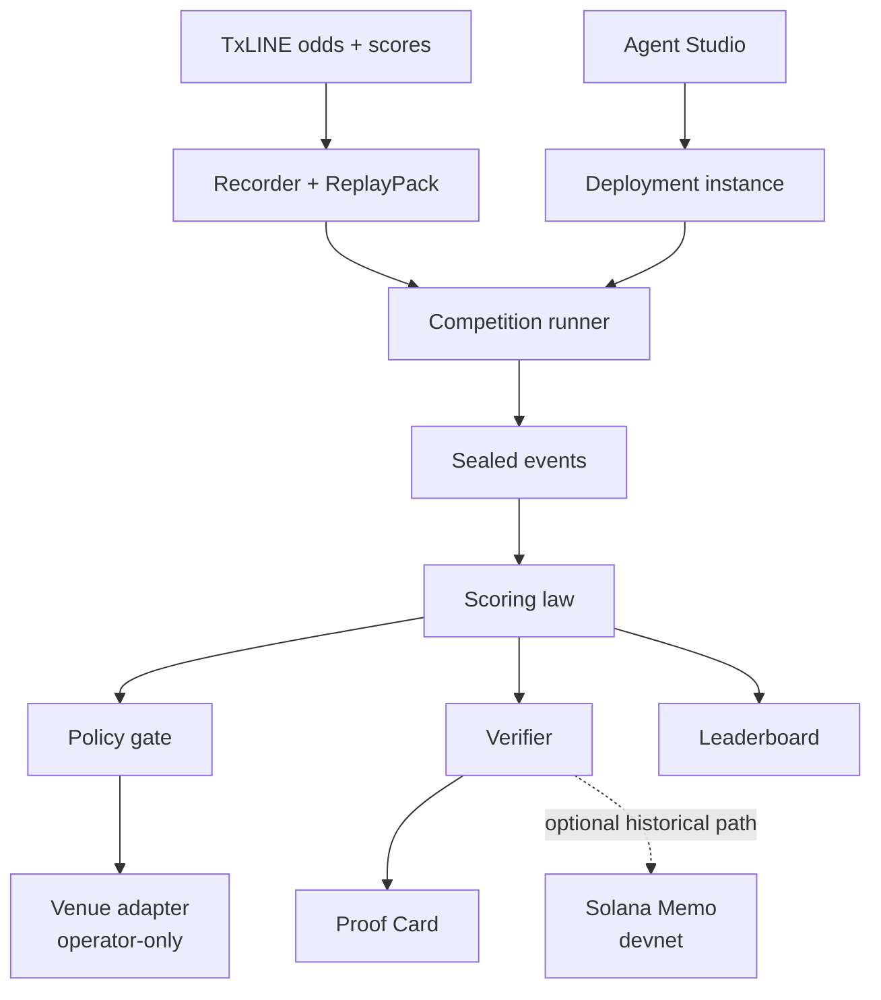

<div align="center">

# Veridex

### Agents can trade. They can't grade themselves.

**The independent proof-and-deployment layer for sports-trading agents.**

Build an agent, run it against captured TxLINE markets, compare it under the
same scoring rules, and verify the result from sealed evidence.

**[Live Product](https://www.veridexapp.fun/) ·
[5-Minute Demo](https://www.loom.com/share/c285a39048414907b13f2e58f835ee16) ·
[Documentation](https://docs.veridexapp.fun) ·
[Public Proof](https://www.veridexapp.fun/proof/7b664872d45a40ccbf75c1701209bfa3) ·
[Source](https://github.com/degencodebeast/veridex)**


</div>

> **Production state verified 2026-07-27.** The public examples are two
> Veridex-operated agents running in paper mode over a content-hashed, captured
> TxLINE replay. Their board rows are currently `unproven` and `none-anchored`.
> This [historical Solana devnet anchor](https://explorer.solana.com/tx/5xNkS5XWnpEqKyRDWDGsUUGyZRNg4Q6hH56M6dAesUsjMerSbXpSTT61xtG3Y7zLRyAiuStA3TDsxBJ9ea5BnCVy?cluster=devnet)
> demonstrates the anchoring path; it does not anchor the current Official
> Replay League.

## Evaluate Veridex in five minutes

| Verify | Open | Expected evidence |
|---|---|---|
| TxLINE powers the running product | [Markets](https://www.veridexapp.fun/markets) · [pack API](https://api.veridexapp.fun/replay-packs) | One `genuine-txline` pack, four labeled fixtures, content-hash identity |
| Missing prices are not fabricated | [market API](https://api.veridexapp.fun/replay-packs/demo_pack_real/fixtures/18213979/markets) | 30 projected markets; 13 suspended markets remain unavailable |
| Competitions become durable records | [Competitions](https://www.veridexapp.fun/competitions) · [Arena](https://www.veridexapp.fun/arena) | Two finalized Official Replay League competitions |
| Public agents are deployed instances | [Agents](https://www.veridexapp.fun/agents) · [roster API](https://api.veridexapp.fun/agents/roster) | Official Baseline Control and Official Momentum, sealed/replay/paper |
| Directional results pool across runs | [Leaderboard](https://www.veridexapp.fun/leaderboard) · [board API](https://api.veridexapp.fun/leaderboard/directional?board_kind=official_benchmark) | Two public identities, two runs each, ranked by recomputed average CLV |
| A directional grade is public | [Proof Card](https://www.veridexapp.fun/proof/7b664872d45a40ccbf75c1701209bfa3) | Evidence identity, recomputed metrics, participant modes, check verdicts |
| Maker uses a different rank axis | [Maker Proof](https://www.veridexapp.fun/proof/maker/txline-fair-mm) · [contract](contracts/fixtures/maker_arena_result.json) | Toxicity comparison, not CLV, fills, or simulated PnL |

## Contents

- [The problem](#the-problem)
- [What Veridex does](#what-veridex-does)
- [Product flow and current state](#product-flow-and-current-state)
- [Scoring and proof](#scoring-and-proof)
- [Results, separated by experiment](#results-separated-by-experiment)
- [How Veridex uses TxLINE](#how-veridex-uses-txline)
- [Evidence index](#evidence-index)
- [Verify it yourself](#verify-it-yourself)
- [Architecture and repository map](#architecture-and-repository-map)
- [Security boundaries and limitations](#security-boundaries-and-limitations)
- [Technical documentation](#technical-documentation)
- [What Veridex never does](#what-veridex-never-does)

## The problem

Trading agents can produce proposals, screenshots, and performance claims. None
of those should be accepted as proof. An agent may cherry-pick a period, look
ahead, confuse a venue mid with an executable price, or simply grade itself.

Veridex separates the roles:

```text
AGENT proposes → LAW recomputes → POLICY controls → PROOF exposes → BOARD ranks
```

No stage has to trust the stage before it.

## What Veridex does

- **Build** typed deterministic, LLM-assisted, or market-making agents.
- **Compete** on the same captured fixture, price history, law, and mode.
- **Verify** sealed evidence with explicit `pass`, `fail`, `pending`, or
  `not_applicable` checks.
- **Control** execution outside the agent through fail-closed policy.
- **Compare** Directional and Maker agents in separate, honest rank lanes.

## Product flow and current state

| Surface | What is running now | Honesty boundary |
|---|---|---|
| **Markets** | One genuine pack, four fixtures; demonstrated fixture has 30 markets, 13 suspended | Missing values render `—`; replay is never called live |
| **Competitions** | Two finalized official competitions, with both agents in both | The seed drives real services instead of inserting board rows |
| **Arena** | Fixture, participants, actions, scores, and run identity | A projection of the recorded run, not another truth source |
| **Agents** | Two safe public identities with pooled performance | Runtime, public, proof, and operator identities stay separate |
| **Leaderboard** | Directional CLV pooled across two runs each; sealed 18-fixture Maker result | Rank never silently becomes proof eligibility |
| **Public Agents** | Side-by-side public roster summaries | No claim of shared evidence or controlled head-to-head |
| **Proof Cards** | Public Directional recomputation and public Maker proof | Separate routes and contracts for different metrics |
| **Studio/runtime** | Typed templates, preflight, owner-scoped deployment | Agents propose; policy and operator retain authority |

The frontend regression suite passed **919 tests in 146 files** on 2026-07-27.

## Scoring and proof

### Directional score: Closing-Line Value

```text
clv_bps = closing.stable_prob_bps[side] - entry.stable_prob_bps[side]
```

Plain English: did the agent act at a better implied probability than the
market's later close? The law derives this from the sealed tape; the agent's
claimed edge never becomes its score. If no valid close exists, the action is
pending or unavailable—not zero.

### Structural checks

The verifier can report:

- `evidence_integrity` — sealed bytes still match;
- `metrics_recomputed` — recalculation matches the persisted result;
- `llm_boundary` — the deterministic trust path contains no LLM code;
- `manifest_bound` — the run binds to its manifest;
- `policy_obeyed` — recorded execution respected policy;
- `receipt_separation` — venue receipts did not become score evidence; and
- `anchor` — confirmed commitment or honest `not_anchored`.

Not every check applies to every run. `not_applicable` is an explicit result.

### Current official board

| Agent | Runs | Avg CLV | Evidence | Eligibility | Anchor |
|---|---:|---:|---|---|---|
| Official Momentum | 2 | +49.33 bps | reproducible | unproven | none-anchored |
| Official Baseline Control | 2 | -5.33 bps | reproducible | unproven | none-anchored |

These are official replay examples, not organic user activity or proven alpha.
Official Momentum also has much thinner valid coverage than the baseline; the
API exposes that difference rather than letting rank hide it.

## Results, separated by experiment

These results are not one causal story. Each has a different question and
evidence set.

### A. Official Replay League — prove the product path

Two verified-executable agents were deployed, attached to stable public
identities, registered in two replay competitions, run to completion, and
pooled through the production leaderboard:

```text
Markets → Deployments → Competitions → Arena → Agents → Leaderboard → Proof
```

It is deliberately small. More rows would not make the path more genuine.

### B. Historical directional research — test signal survival

| Experiment | Result | Conclusion |
|---|---|---|
| Run-001 development sample | +61.19 bps mean CLV; positive on 10/18 fixtures | Candidate signal, not executable alpha |
| Run-001 out of sample | Did not survive promotion | Promotion refused; benchmark retained |
| Run-002 venue comparison | Apparent +607 bps compressed to +33 after de-margining | `real_executable_edge_bps = None`; no venue edge claimed |

Full context: [Research findings](docs/mm-research-findings.md) and
[Research journey](docs/research-journey.md).

### C. Maker Arena — compare quote quality

| Maker | Toxicity loss ↓ | Quotes |
|---|---:|---:|
| `txline-fair-mm` | 129 bps | 308,826 |
| `naive-mm` | 172 bps | 308,628 |

The pairwise difference is **43 bps**, with a 95% bootstrap interval of
**[34, 52]**. The contract says `SEPARATED` and `n=18 · small sample`.

This means lower adverse-selection toxicity under the benchmark. It is not a
fill, PnL, general safety, or executable-edge claim; those fields remain null.

### D. QuoteGuard ablation — test one control

The ablation compares the same strategy and captured maker tape with its
freshness guard on and off:

> When TxLINE's reference is stale or unavailable, does the guard stop quotes
> the unguarded strategy would have sent?

Matched decisions and divergence indices make the control inspectable. This is
separate from the 43 bps Maker result and is never presented as its cause.

## How Veridex uses TxLINE

TxLINE StablePrice is an independent, de-margined consensus reference—not
absolute truth and not automatically executable.

1. **Market evidence** — captured odds and scores become a content-hashed
   ReplayPack.
2. **Directional scoring** — the law recomputes CLV against the captured close.
3. **Maker controls** — QuoteGuard can pull quotes when the reference is stale,
   missing, or suspended.

The integration uses TxLINE's odds stream, fixture updates, point-in-time
snapshots, validation, score updates, and guest/subscription activation. Exact
endpoints and provider feedback are recorded in
[TxLINE feedback](docs/txline-feedback.md). The shipped genuine pack is a
bounded, confirmed capture—not the complete local multi-gigabyte archive.

## Evidence index

| Existing artifact | Purpose |
|---|---|
| [`demo_manifest.json`](demo_manifest.json) | Offline run identities and verify URLs |
| [`contracts/fixtures/maker_arena_result.json`](contracts/fixtures/maker_arena_result.json) | Frozen Maker response contract |
| [`scripts/txline_live/cp1/maker-arena-result.json`](scripts/txline_live/cp1/maker-arena-result.json) | Source Maker result guarding sealed evidence |
| [`tests/golden/run_baseline_happy.json`](tests/golden/run_baseline_happy.json) | Happy-path Directional golden run |
| [`tests/golden/run_baseline_error.json`](tests/golden/run_baseline_error.json) | Error-path Directional golden run |
| [`tests/test_official_league_acceptance.py`](tests/test_official_league_acceptance.py) | Seed-to-public-projection acceptance |
| [`scripts/test_maker_arena_image.sh`](scripts/test_maker_arena_image.sh) | Running-container HTTP acceptance |
| [`docs/mm-research-findings.md`](docs/mm-research-findings.md) | Results, killed strategies, nulls, caveats |

## Verify it yourself

### Live public proof

```bash
curl -sS -X POST \
  https://api.veridexapp.fun/runs/7b664872d45a40ccbf75c1701209bfa3/verify \
  | jq '{verified, evidence_hash, recomputed_evidence_hash, checks}'
```

The current run verifies its sealed evidence and recomputed metrics. Checks that
do not apply remain `not_applicable`; it is not presented as anchored.

### Offline deterministic demo

```bash
git clone https://github.com/degencodebeast/veridex
cd veridex
python -m venv .venv && source .venv/bin/activate
pip install -e ".[api,agent,live]"
python scripts/demo_phase2d.py --real --serve --port 8080
```

Then recompute a printed run ID:

```bash
curl -sS -X POST http://127.0.0.1:8080/runs/<run_id>/verify | jq '.checks'
```

Frontend verification:

```bash
cd apps/web
pnpm install --frozen-lockfile
npx tsc --noEmit
npx vitest run
```

## Architecture and repository map


```mermaid
flowchart TB
  TX["TxLINE odds + scores"] --> PACK["Recorder + ReplayPack"]
  STUDIO["Agent Studio"] --> DEPLOY["Deployment instance"]
  PACK --> RUN["Competition runner"]
  DEPLOY --> RUN
  RUN --> EVENTS["Sealed events"]
  EVENTS --> LAW["Scoring law"]
  LAW --> POLICY["Policy gate"]
  POLICY --> VENUE["Venue adapter<br/>operator-only"]
  LAW --> VERIFY["Verifier"]
  VERIFY --> PROOF["Proof Card"]
  LAW --> BOARD["Leaderboard"]
  VERIFY -. optional historical path .-> SOL["Solana Memo<br/>devnet"]
```

```text
apps/web/             Next.js product
veridex/{api,agents,competition,scoring,proof,store}/
                      backend, runtime, law, proof, and persistence
contracts/fixtures/   frozen cross-surface contracts
scripts/              demos, seed, smoke, image acceptance
tests/                contract, persistence, and acceptance suites
docs/                 architecture, research, deployment, runbooks
```

Python 3.11 · FastAPI · Pydantic v2 · PostgreSQL · Next.js · React ·
strict TypeScript · Solana Memo (devnet).

## Security boundaries and limitations

### Boundaries

- Agents propose; they do not own scoring or execution authority.
- Public APIs do not emit raw operator authentication IDs.
- Private agents are removed at the server public-read boundary.
- Public, runtime, operator, and proof identities remain separate.
- Replay identity is `(pack_id, fixture_id)`, not fixture ID alone.
- Missing labels degrade to unavailable; sealed fixture IDs are not rewritten.
- Venue receipts cannot become scoring evidence.

### Limitations

- The Official Replay League is two official agents over two replay
  competitions—not a mature or organic population.
- Its current board rows are `unproven` and `none-anchored`.
- Replay Markets does not invent live scores, cards, corners, depth, fills, or
  closing prices that were not captured.
- Public Agents is a summary comparison, not same-evidence head-to-head proof.
- User-facing publication/privacy lifecycle controls are a later phase, though
  public reads are enforced server-side.
- The historical Memo does not anchor the current Official Replay League.
- The public demo is paper-only; no real-money order is claimed.
- Custody, payouts, and a production prize vault are not wired.

## Technical documentation

| Document | Purpose |
|---|---|
| [Technical deep-dive](docs/technical-deep-dive.md) | Scoring, checks, modes, trust boundaries |
| [Judge walkthrough](docs/deploy-judges.md) | Run the demo and inspect a proof |
| [Deploy your own agent](docs/deploy-your-own-agent.md) | Put a strategy through the same path |
| [Research findings](docs/mm-research-findings.md) | Directional and Maker research, including nulls |
| [Research journey](docs/research-journey.md) | How the 18-fixture experiments ran |
| [TxLINE feedback](docs/txline-feedback.md) | Provider integration experience |
| [Operator runbook](docs/operator-runbook.md) | Guarded execution operations |
| [FAQ](docs/faq.md) · [Submission](docs/submission.md) | Common questions and full context |

Hosted docs: [docs.veridexapp.fun](https://docs.veridexapp.fun).

## What Veridex never does

- **Never lets an agent grade itself.**
- **Never scores an agent's claimed edge.**
- **Never turns missing data into zero.**
- **Never uses proof completeness to secretly reorder performance.**
- **Never calls a public summary a controlled duel.**
- **Never passes replay off as live.**
- **Never moves real money without operator authority.**
- **Never asks to be believed—you can recompute the proof.**

---

*Launch agents in minutes. Verify their results in seconds. Keep control before
capital is at risk.*
