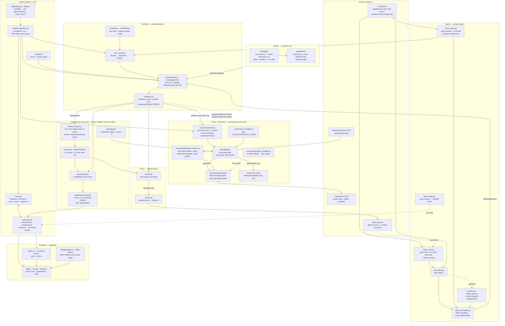
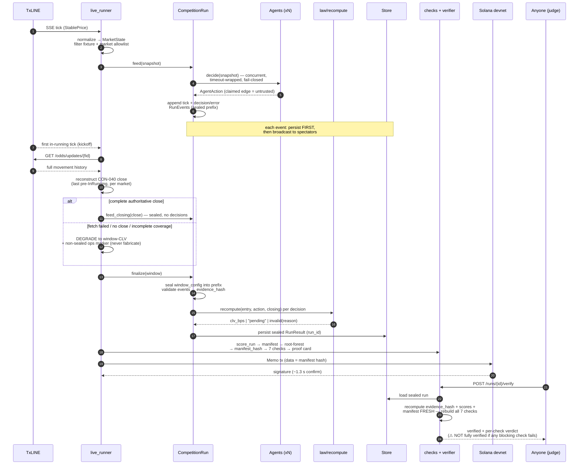
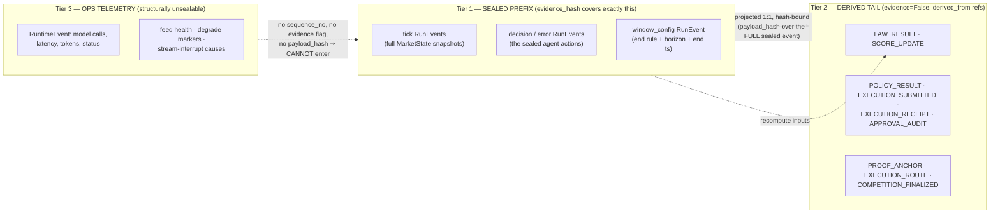
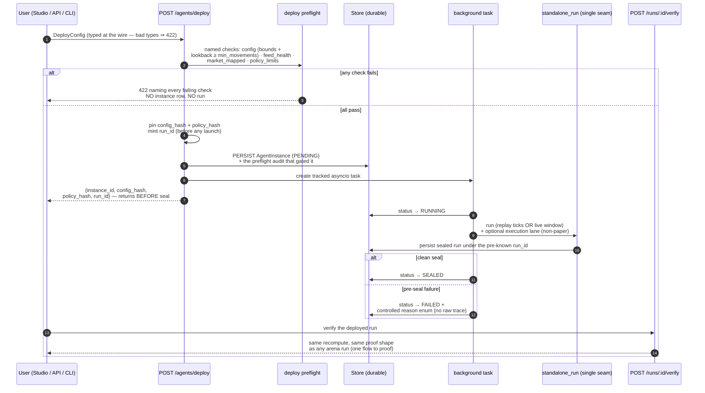
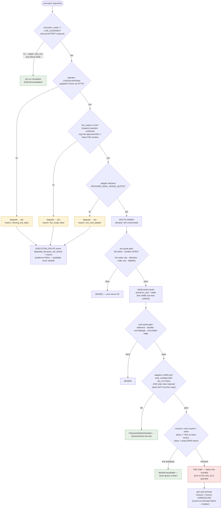
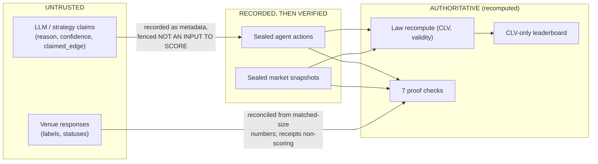

# Veridex — System Architecture

> How everything works together: components, data flow, trust boundaries, and the diagrams that
> tie them into one picture. This is the companion to the
> [technical deep-dive](technical-deep-dive.md), which explains every design decision in depth
> with file-and-line references — this document is the map; the deep-dive is the territory.

**Honesty note (read first).** The diagrams below show the *built* system. Where a path exists in
code but has never been exercised with real money (the Polymarket write path), or is designed but
not wired (custody/payouts), the diagram and the text say so. No real-money order has ever been
placed; the live path is fail-closed and operator-only by construction.

---

## Contents

1. [The one-paragraph architecture](#1-the-one-paragraph-architecture)
2. [The big picture (system diagram)](#2-the-big-picture-system-diagram)
3. [Layer responsibilities](#3-layer-responsibilities)
4. [The proof loop (sequence diagram)](#4-the-proof-loop-sequence-diagram)
5. [The event model — three tiers](#5-the-event-model--three-tiers)
6. [The deploy flow (sequence diagram)](#6-the-deploy-flow-sequence-diagram)
7. [The live-money conjunction (gate diagram)](#7-the-live-money-conjunction-gate-diagram)
8. [Trust boundaries at a glance](#8-trust-boundaries-at-a-glance)
9. [Repository layout → architecture mapping](#9-repository-layout--architecture-mapping)

---

## 1. The one-paragraph architecture

Veridex is one chain in which **no link trusts the previous one**:

```
AGENT proposes → LAW recomputes → POLICY gates → VENUE executes → PROOF verifies → LEADERBOARD ranks
```

TxLINE de-margined odds flow through **one normalizer** into frozen per-tick `MarketState`
snapshots. The **runtime** runs N agents concurrently on identical snapshots and seals the run —
ticks, decisions, errors, and (for live windows) the reconstructed closing line — into a
hash-covered **sealed prefix**. The **law** deterministically recomputes edge/CLV from those
sealed bytes, never from an agent's claims. The **policy gate** decides, in two phases around the
venue quote, whether acting is *safe*; the **venue adapter** executes behind multiple independent
locks, and its receipts are structurally non-scoring. The **proof layer** recomputes everything
fresh — seven falsifiable checks, a Merkle root-forest, a manifest hash anchored as a Solana
Memo — and exposes `POST /runs/{id}/verify` so anyone can re-derive the verdict. The
**leaderboard** ranks on recomputed CLV only. The **deploy platform** (Studio, API, CLI/SDK) pins
typed, bounded configs into durable `AgentInstance` records and launches every run through one
shared runner seam, so deployed agents earn the exact same proof as arena runs.

---

## 2. The big picture (system diagram)



Reading keys for the diagram:

- **Solid arrows** are data/control flow. **Dotted arrows** are deliberately weak couplings —
  ops-only telemetry, or the receipts edge, which exists only to say it *does not* flow back.
- Everything inside **"Deterministic trust core"** is statically import-audited to contain zero
  LLM SDK code (`veridex/verifier/import_audit.py`), and the audit itself runs as the live
  `llm_boundary` proof check.
- The **execution lane hangs off the sealed run**, not off the agents: it consumes sealed
  `score_rows` only, and nothing it produces can alter a score, a hash, or a rank
  (proven byte-for-byte in `tests/test_standalone_run.py:220` and
  `tests/test_execution_integration.py:165`).
- The **single runner seam** (`veridex_agent/run.py::standalone_run`) is the only path from "a
  configured agent" to "a sealed, verified run" — the deploy endpoint, the CLI, and the SDK all
  route through it. No parallel runner exists.

---

## 3. Layer responsibilities

| Layer | Modules | Owns | Must never |
|---|---|---|---|
| **Ingest** | `veridex/ingest/` | Auth, SSE stream, odds history, the ONE normalizer, ReplayPacks, CON-040 closing reconstruction, feed health | Let telemetry (feed health) become evidence; parse live and replay through different code paths |
| **Agents** | `veridex/strategies/`, `veridex/runtime/agent.py` | Proposing constrained `AgentAction`s; strategy state over past ticks only | Score themselves; see a future tick; differ in inputs from a co-competing agent |
| **Runtime** | `veridex/runtime/` | The incremental run core (feed/finalize), live windows, the sealed prefix, evidence hashing, persist-then-broadcast | Let concurrency reach the deterministic seal; feed a tick after finalize; fabricate a closing line |
| **Trust core** | `veridex/law/`, `scoring.py`, `leaderboard.py`, `checks/`, `verifier/`, `policy/`, `ingest/` | Recomputing every number from sealed evidence; the 7 checks; CLV-only ranking | Import an LLM SDK; trust a claimed edge; hardcode a PASS; rank on anything but CLV |
| **Policy + execution** | `veridex/policy/`, `veridex/execution/`, `veridex/venues/` | Two-phase gating, the breaker, sizing, honest receipts, fail-closed venue resolution, the operator-only live path | Mint a second gating authority; fabricate a fill; guess a token; place real money without every lock open |
| **Chain** | `veridex/chain/` | Merkle root-forest, the manifest, the Memo anchor | Anchor anything other than the manifest hash; claim an anchor that didn't happen |
| **Platform** | `veridex/api/`, `veridex/deploy/`, `veridex/backtest/`, `veridex/competition/`, `veridex/store.py`, `veridex_agent/` | The deploy loop, durable AgentInstances, the verify/read API, the canonical event log, backtests, the single runner seam | Launch without a persisted instance; pass live-money deps over HTTP; leak a raw trace into a record or response |
| **Frontend** | `apps/web/` | Rendering served truth: contracts-first adapters, the edge display gate, the untrusted-LLM fence, honest mode labels | Reimplement law/scoring/checks; compute a client-side "pinned" hash; render an edge without a real venue quote |

---

## 4. The proof loop (sequence diagram)

One windowed live run, end to end — the flow a judge's Verify click retraces:



Two properties make this loop trustworthy rather than decorative:

1. **The proof is always downstream of the seal** — scores, checks, manifest, and anchor are
   computed only after `finalize`, from sealed bytes (`veridex/runtime/live_runner.py:417-451`).
2. **Verify recomputes; it never echoes.** Step 20 re-derives the score rows and the manifest from
   the sealed prefix, so a doctored persisted score is caught even when the seal is intact
   (`veridex/verifier/recompute.py:171-233`; `metrics_recomputed` in
   `veridex/checks/build.py:182-318`).

---

## 5. The event model — three tiers



- Tier 1 is what `evidence_integrity` protects; change one byte and verification fails.
- Tier 2 is recomputable *from* Tier 1 — which is why tampering it is caught by
  `metrics_recomputed` rather than needing to be hashed itself. Receipts live here and can never
  become skill evidence (`receipt_separation`).
- Tier 3 is made unsealable by *shape*: a `RuntimeEvent` lacks the three fields the evidence path
  requires (`veridex/runtime/runtime_events.py:1-13`), so no bug or config can promote telemetry
  into proof.
- The live spectator stream is a verified projection of Tier 1 + 2: finalize asserts the
  live-persisted prefix is byte-equivalent to the offline projection before appending the tail
  (`veridex/competition/service.py:417-427`).

---

## 6. The deploy flow (sequence diagram)

`configure → preflight → deploy → observe → verify`, as actually wired:



Design points visible in the diagram: **persist-then-launch** (a refused deploy leaves zero rows;
a crashed process leaves a durable record), **return-before-seal** (the response never blocks on a
multi-hour window), the **controlled failure vocabulary** (raw tracebacks go to logs only), and
**one flow to proof** (deployed runs verify through the identical endpoint as arena runs).

---

## 7. The live-money conjunction (gate diagram)

Every clause below must hold for one real order. Missing any clause does not error — it degrades
to a dry simulation that records *why*.



The two shaded families tell the safety story: green boxes are safe terminal states you reach *by
default* (the safe state is the state you get by doing nothing); the single red box — a real
submit — is reachable only through every gate in sequence, and to date **it has never been
exercised with real funds** (the first 1-share smoke is a human decision in the
[operator runbook](operator-runbook.md)). Note also that the route gates and the adapter lock are
**independent**: the money gate does not trust the routing layer, so a bug in one lock still
leaves the other closed.

---

## 8. Trust boundaries at a glance



The full invariant registry — thirteen rules, each with the test, audit, or CHECK constraint that
enforces it — is [deep-dive §14](technical-deep-dive.md#14-the-trust-boundary-registry). The five
most load-bearing:

1. **Checks ≠ metrics** — CLV is never a check; checks certify the record, metrics rank
   performance.
2. **No hardcoded PASS** — every check recomputes from sealed evidence and fails closed.
3. **Receipts non-scoring** — a fill can never become proof; provably causally inert.
4. **CLV-only ranking** — confidence, Kelly, and proof-completeness never enter a rank key.
5. **Zero LLM SDK in the trust path** — statically audited, fail-closed if a trust directory is
   missing.

---

## 9. Repository layout → architecture mapping

```
veridex-arena/
├── veridex/                  # Python backend — the proof engine
│   ├── ingest/               #   §2 diagram: Ingest (auth, normalizer, packs, feed health)
│   ├── runtime/              #   Runtime (CompetitionRun, live runner, window, evidence seal)
│   ├── law/                  #   Trust core: the deterministic law + executable edge
│   ├── checks/               #   Trust core: the 7-check taxonomy
│   ├── verifier/             #   Trust core: verify_run + proof cards + the import audit
│   ├── scoring.py            #   Trust core: is_scored + the metric stack
│   ├── leaderboard.py        #   Trust core: cross-run CLV-only ranking
│   ├── policy/               #   Two-phase gate · envelope · pure circuit breaker
│   ├── execution/            #   The execution lane (receipts non-scoring) + edge legibility
│   ├── venues/               #   VenueAdapter seam · Polymarket read/write · resolver · preflight
│   │   └── _vendor/          #   Vendored, pinned MIT-licensed Polymarket CLOB client
│   ├── strategies/           #   Agents: momentum v1 · Sharp Momentum v2 · value · sharp stats
│   ├── backtest/             #   BacktestRunner + honest-mode reports
│   ├── deploy/               #   Deploy preflight · durable AgentInstance
│   ├── competition/          #   Arena service · canonical event log · operator live routing
│   ├── chain/                #   Merkle root-forest + Solana Memo anchor
│   ├── api/                  #   FastAPI: verify · deploy · leaderboard · WS · demo
│   └── store.py              #   Postgres / in-memory persistence
├── veridex_agent/            # The SDK/CLI — routes through the SAME single runner seam
├── apps/web/                 # Next.js frontend (Studio · Cockpit · Inspector · Proof Card)
├── scripts/                  # demo_phase2d.py (judge demo) · operator smoke · live tooling
├── tests/                    # 1,000+ offline tests incl. the byte-for-byte golden seal suite
└── docs/                     # this file · technical-deep-dive.md · runbooks · FAQ
```

For the depth behind any box in these diagrams — the design decision, its rejected alternative,
the enforcing test, and the file:line — go to the
[technical deep-dive](technical-deep-dive.md): §2 data layer, §3 runtime, §4 law/scoring, §5
proof, §6 policy/execution, §7 price-unit honesty, §8 venues, §9 the live-money conjunction, §10
strategies, §11 deploy, §12 the real-data experiment, §16 the design-decision ledger.
